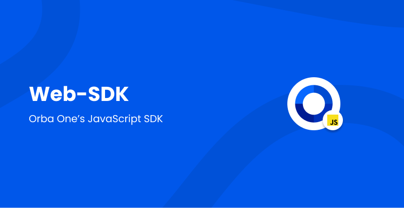

<hr>

# Orba One

To integrate the Orba One SDK, follow this guide and use your
own API Key which you can obtained from the developer dashboard.

---

[](https://badge.fury.io/js/%40orbaone%2Fcore)

---

The integration of the Orba One Web SDK follows these simple steps:

1. Install the SDK through NPM / Yarn
2. Get an API Key
3. Render the Orba One verification button and handle the result

Additionally, there is a non package manager installation option. You can start using Orba One SDK library by directly by including it in your HTML file. Instructions can be found **[here](#Browser)**.

# 1. Install the SDK

```bash
# Yarn
yarn add @orbaone/core

# NPM
npm install --save @orbaone/core
```

# 2. Get an API Key

Orba One uses API keys to allow access to the API and show onboarded users in your dashboard. Login to your Orba One account and create a new Orba One API key form your [Developer Dashboard](https://dashboard.orbaone.com).

# 3. Render the verification button

**Import the Orba One SDK**

```javascript
import { renderButton } from "@orbaone/core";
```

#### Example Usage

```javascript
renderButton({
  apiKey: "exampleAPIKey",
  target: "#button",
  applicantId: "",
  companyId: "",
  disableStyle: false,
  onSuccess: (data) => {console.log(data)},
  onError: (err) => {console.log(err)},
  onCancelled: (state) => {console.log(state);},       
})
```

#### renderButton(config) Options

| Parameter    | Type                 | Description                                                               |
| ------------ | -------------------- | --------------------------------------------------------------------------|
| target       | string or DOMElement | The DOM element you want to mount the button on.                          |
| apiKey       | string               | The OrbaOne Key you obtained from the dashboard.                          |
| applicantId  | string (optional)    | The id of the applicant being verified                                    |
| companyId    | string (optional)    | The id of the company being verified                                      |
| apiKey       | string               | The OrbaOne Key you obtained from the dashboard.                          |
| disableStyle | boolean (optional)   | The OrbaOne Key you obtained from the dashboard.                          |
| onSuccess    | function             | Callback function that is triggered after onboarding is complete.         |
| onError      | function             | Callback function that is triggered if onboarding has failed.             |
| onCancelled  | function             | Callback function that is triggered when the state of the button changes. |
| steps        | array                | Array of verification steps.                                              |

## Browser

OrbaOne is available over [unpkg](https://unpkg.com/) CDN

```htm
<script type="text/javascript" defer="true" src="https://unpkg.com/@orbaone/core" />
```

#### Example Usage

```html
<script type="text/javascript">
    OrbaOne.renderButton({
        apiKey: "exampleAPIKey",
        target: "#button",
        applicantId: "",
        companyId: "",
        disableStyle: false,
        onSuccess: (data) => {
            console.log(data);
        },
        onError: (err) => {
            console.log(err);
        },
        onChange: (state) => {
             console.log(state);
        },
        steps: ["welcome"],
    });
</script>
```
